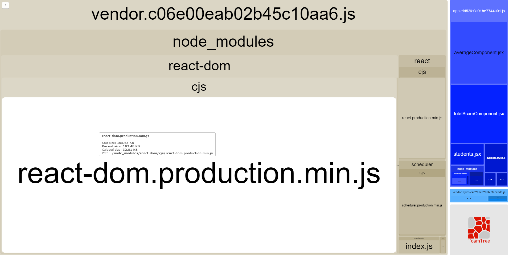

# 06 Bundle Analyzer

In this demo we are going to configure Webpack Bundle Analyzer plugin, this is a plugin that help us to visualize size of webpack output files with an interactive zoomable treemap.

We will start from sample _03 Environments/05 dotenv_.

Summary steps:

- Install Webpack Bundle Analyzer plugin.
- Add performance config file.
- Add the configuration to performance config file.
- Create execution script.

# Steps to build it

## Prerequisites

Prerequisites, you will need to have nodejs installed in your computer. If you want to follow this step guides you will need to take as starting point sample _05 dotenv_.

## Steps

- `npm install` to install previous sample packages:

```
npm install
```

- Let's go with the plugin installation

```
npm install webpack-bundle-analyzer --save-dev
```

- Now it's time to create performance configuration file, this will use our production configuration file as a base(prod.webpack.config.js).

_./perf.webpack.config.js_

We will use `webpack-merge` to combine `prod.webpack.config.js` with performance specific config settings.

- Our performance config file look like:

```javascript
const merge = require("webpack-merge");
const prod = require("./prod.webpack.config.js");
const { BundleAnalyzerPlugin } = require("webpack-bundle-analyzer");

module.exports = merge(prod, {
  plugins: [new BundleAnalyzerPlugin()]
});
```

Finally, we need to update command script:

_./package.json_

```diff
{
  ...
  "scripts": {
    ...
    "build:prod": "rimraf dist && webpack --config prod.webpack.config.js",
+   "build:perf": "rimraf dist && webpack --config perf.webpack.config.js"
  },
  ...
}
```

- Now we can see our interactive treemap working! Simply execute the command `npm run build:perf`




- How can we reduce the jquery dependency size? Jquery comes with `slim` version, how can we use it?:

_./base.webpack.config.js_

```diff
...
  resolve: {
    extensions: ['.js', '.jsx', '.ts', '.tsx'],
+   alias: {
+     jquery: 'jquery/dist/jquery.slim.js',
+   },
  },
  ...
```
